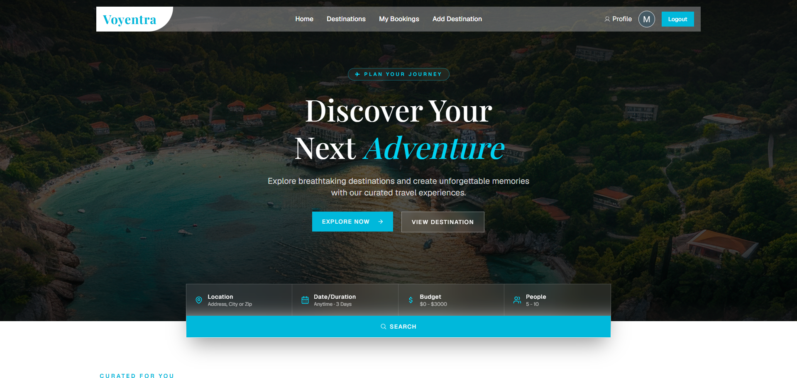
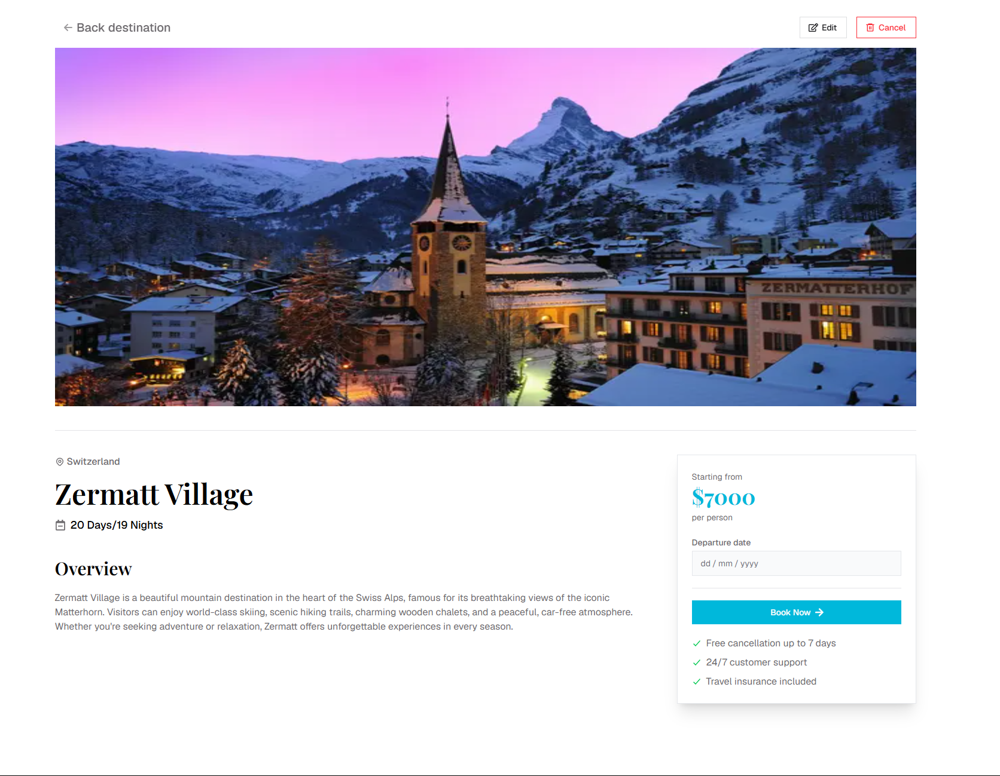
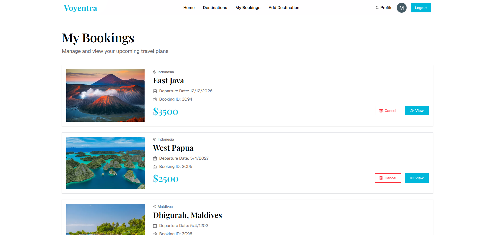
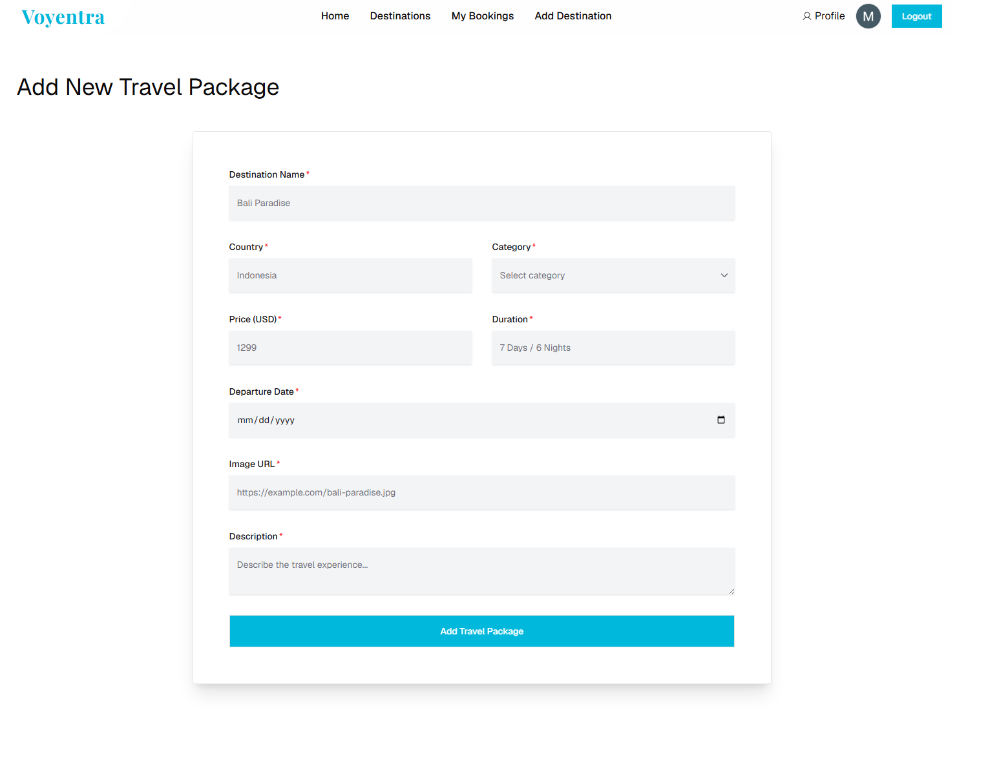

# 🌍 Voyentra

> **Voyentra** is a modern full-stack travel destination booking platform that enables users to discover destinations, book trips, and manage their bookings through a secure and intuitive interface. Built with **Next.js**, **Node.js**, **Express.js**, **MongoDB**, and **Better Auth**, the project demonstrates modern full-stack development practices with a responsive and user-friendly design.


---

# 🚀 Project Links

| Resource | Link |
|----------|------|
| 🌐 Live Demo | https://voyentra.vercel.app/ |
| 💻 Client Repository | https://github.com/sabbirRashed/Voyentra |
| ⚙️ Backend Repository | https://github.com/sabbirRashed/Voyentra-Backend |

---

# 📖 Overview

Voyentra is a full-stack travel destination booking platform where users can explore destinations, view detailed information, and make bookings through a secure authentication system.

The project is built using the latest **Next.js App Router**, while the backend is developed with **Node.js** and **Express.js**. MongoDB is used as the primary database, and Better Auth provides secure authentication and session management.

The application focuses on clean architecture, reusable components, responsive design, and a smooth user experience.

---

# ✨ Key Features

### 🔐 Authentication

- Secure user authentication with Better Auth
- User Registration
- User Login
- Persistent Sessions
- Protected Routes

### 🌍 Destination Management

- Browse available destinations
- View destination details
- Add new destinations
- Edit destination information
- Delete destinations

### 📅 Booking System

- Book travel destinations
- View all personal bookings
- Cancel bookings
- Prevent duplicate bookings

### 🎨 User Experience

- Fully responsive design
- Modern UI with Hero UI
- Toast notifications
- Smooth animations using Framer Motion
- Loading & Error handling pages

### ⚡ Performance

- Next.js App Router
- Server Components
- Dynamic Routing
- Optimized Rendering
- Reusable Components

---

# 🏗️ Project Architecture

```text
                    User
                      │
                      ▼
           Next.js Frontend (Client)
                      │
             REST API Requests
                      │
                      ▼
        Node.js + Express.js Backend
                      │
          Better Auth Authentication
                      │
                      ▼
               MongoDB Atlas
```

---

# 🛠️ Tech Stack

## Frontend

- Next.js 16
- React 19
- Hero UI
- Tailwind CSS v4
- Framer Motion
- React Icons
- Gravity UI Icons

## Backend

- Node.js
- Express.js
- REST API
- Better Auth

## Database

- MongoDB

## Deployment

- Vercel (Frontend)
- Backend (Separate Express Server)

---

# 📂 Project Structure

```
src
│
├── app
│   ├── (auth)
│   │   ├── login
│   │   └── signUp
│   │
│   ├── (main)
│   │   ├── add-destination
│   │   ├── bookings
│   │   ├── destinations
│   │   └── page.jsx
│   │
│   ├── api
│   ├── layout.jsx
│   ├── page.jsx
│   ├── loading.jsx
│   └── not-found.jsx
│
├── components
│   ├── Navbar.jsx
│   ├── Banner.jsx
│   ├── DestinationCard.jsx
│   ├── FeaturedSection.jsx
│   ├── BookingCard.jsx
│   ├── MyBookingCard.jsx
│   ├── EditModal.jsx
│   └── Footer.jsx
│
└── lib
    ├── action.js
    ├── auth.js
    └── auth-client.js
```

---

# 📚 Tech Highlights

- Next.js App Router
- React Server Components
- Dynamic Routing
- Better Auth Authentication
- MongoDB Integration
- RESTful API
- Responsive UI
- Component-Based Architecture
- Modern Folder Structure

---

# 📦 Installation

## Clone the Client Repository

```bash
git clone https://github.com/sabbirRashed/Voyentra.git
```

## Clone the Backend Repository

```bash
git clone https://github.com/sabbirRashed/Voyentra-Backend.git
```

---

## Install Client Dependencies

```bash
cd Voyentra
npm install
```

---

## Install Backend Dependencies

```bash
cd Voyentra-Backend
npm install
```

---

## Environment Variables

Create a `.env.local` file inside the client project.

```env
BETTER_AUTH_SECRET=your_secret
BETTER_AUTH_URL=http://localhost:3000
NEXT_PUBLIC_API_URL=http://localhost:5000
```

Create a `.env` file inside the backend project.

```env
MONGODB_URI=your_mongodb_connection_string
PORT=5000
```

---

# ▶️ Run the Project

### Start Backend

```bash
npm run dev
```

### Start Frontend

```bash
npm run dev
```

Frontend:

```
http://localhost:3000
```

Backend:

```
http://localhost:5000
```

---

# 📸 Screenshots

> Replace these with actual screenshots.

| Home | Destination Details |
|------|---------------------|
|    |    |

| My Bookings | Add Destination |
|-------------|-----------------|
|    |    |

---

# 📚 What I Learned

This project helped me gain practical experience in:

- Building full-stack applications with Next.js
- Creating RESTful APIs using Express.js
- Implementing authentication with Better Auth
- Integrating MongoDB with both frontend and backend
- Working with Server Components and App Router
- Designing reusable React components
- Managing authentication and protected routes
- Building responsive interfaces with Tailwind CSS and Hero UI

---

# 🚧 Challenges

Some challenges I solved during development include:

- Managing authentication sessions securely
- Designing reusable UI components
- Handling protected routes
- Structuring a scalable Next.js project

---

# 🔮 Future Improvements

- User Profile Management
- Destination Search & Filtering
- Wishlist Feature
- Reviews & Ratings
- Payment Gateway Integration
- Booking History
- Admin Dashboard
- Email Notifications

---

# 👨‍💻 Author

**Md. Sabbir Rahman**

- GitHub: https://github.com/sabbirRashed
- LinkedIn: https://www.linkedin.com/in/sabbirrahman

---

# ⭐ Support

If you found this project helpful or interesting, consider giving it a **⭐ Star** on GitHub. Your support motivates me to build more high-quality projects and contribute to the developer community.